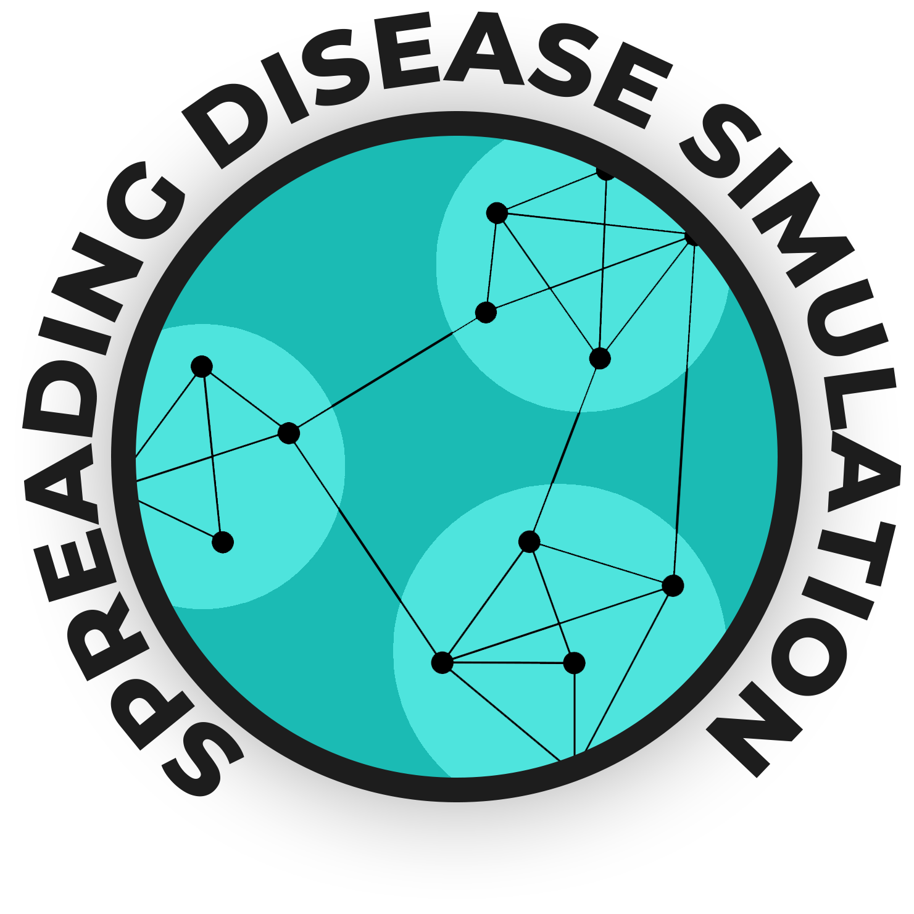

<h1 align="center">SPREADING DISEASE SIMULATION</h1>
<div align="center">

</div>

# Table of Contents
- [Introduction](#introduction)
- [Installation](#installation)
- [Simulation](#simulation)
  - [List of available flags](#list-of-available-flags)
- [Examples](#examples)
  - [Header Data](#header-data)
- [Project Timeline](#project-timeline)

# Introduction
With this project we built a tool that is able to simulate the spreading of a certain virus over a big network, analyze the impact on healthcare system and observe the effects of containment policies like wearing musks and social distacing.
We also provided a customizable python script that plots, running the tool with montecarlo simulation flag, some metrics with Confidence Intervals.
For example, simulating a spanish flu like spreading, we observe:
<div align="left">
  <div align="center">
    
    <p>No measures</p>
  <div>
  <div align="center">
    
    <p>Musk policy</p>
  <div>
  <div align="center">
    
    <p>Social Distacing policy</p>
  <div>
</div>  

# Installation
Assuming that you have golang installed on your machine [here instructions](#https://golang.org/doc/install).
If you don't have already generated a Network.json file in your project folder run the following:

```
go run . -savenet=true
```
Now you will find the file in timestamp/Network.json, now you should move this file in the main project folder, or use the flag **-filenet=timestamp/Network.json**.
Assuming that you choose the first option, in order to run the simulation over the generated Network:

```
go run . -loadnet=true
```

In order to avoid running the simulation run the generation of the network with:

```
go run . -savenet=true -mctrials=0
```

# Simulation

If you want to run a Montecarlo Simulation you chan choose how many trials to run, for example for 100 trials:

```
go run . -loadnet=true -mctrials=100
```

and if you want also to compute the CI over all the three metrics [Total Cases, Recovered, Deaths]:

```
go run . -loadnet=true -mctrials=100 -computeCI=true
```

alternatively, you can run a simulation computing CI on python script, allocating a random net, and performing 100 trials by running:

```
go run . --computeCI=true --mctrials=100 --runpyscript=true
```

Finally, to get information about national healthcare system, metrics and disease spreding with 20 trials run:

```
go run . --computeCI=true --mctrials=20 --runpyscript=true --computeSSN=true
```

In Scripts folder you can find the python script to elaborate graphs, you can also run the simulation and only after produce graphs by calling the python script as for example with a timestamp of 1591033168543190400:

```
python .\Scripts\plotgraphs.py --trialsFile=simulation_trials_results.csv --folder=1591033168543190400/ --ssnFile=simulation_ssn_results.csv
```

## List of available flags
- **-loadnet**: default value is false, if true it load a network from a file called Network.json, to change the loading file name check flag namenet
- **-savenet**: default value is false, if true saves network on timestamp/Network.json
- **-namenet**: default value is Network.json, it's the name of the network file
- **-mctrials**: default value is 1, you can choose how many trials run on the Montecarlo Simulation
- **-computeCI**: default value is false, set to true when use flag -mctrials > 1 to get Confidence Intervals of metrics
- **-runpyscript**: default valuse is false, set to true if you want to print graphs of simulation with matplotlib

# Examples
In the example folder you can find the results in .csv format for couple simulations with the same virus, but applying containment measures vs no measures.

The virus information are:
- R0: median 5, std 0.8
- Infective Epochs: 14
- Dead Rate: 5.4%

The containment measures are:
- Musk: from day 30 with prevention probability of 95% cases of contact
- Social Distance: from day 40 with contact allowed only between parents and friends

## Header Data
The exported .csv files header is the following:
- ACTIVE CASES
- NEW CASES RESPECT YESTERDAY
- TOTAL CASES
- SURVIVED CASES
- DEAD CASES

# Project Timeline
- [X] Defining Main Project Objectives
- [X] Create a Big Network Graph of the Population
- [X] Gather Information about Italian Hospitals
- [X] Gather Information about different viruses
- [X] Coding the core-project  (**work in progress**)
- [X] Montecarlo Simulation and CI
- [ ] Final Report (**work in progress**)